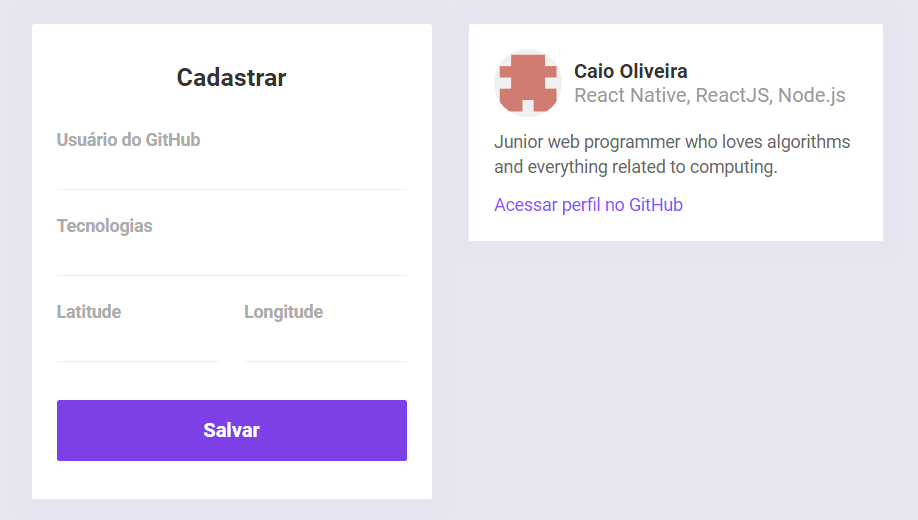
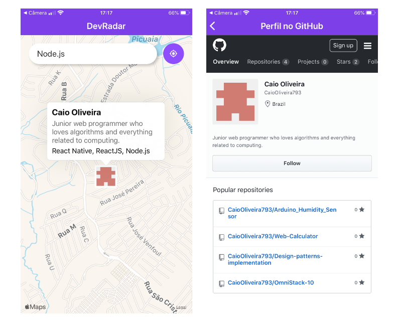

# DevRadar (Omnistack-10)

Projeto desenvolvido durante a semana Omnistack 10 da [Rocketseat](https://github.com/Rocketseat)

## Objetivo

Encontrar desenvolvedores que trabalham perto de você com a mesma tecnologia.

## Tecnologias

Foi utilizado todas as tecnologias da Omnistack:

- React JS (Web)
- React Native (Mobile)
- Node.js (Backend)

## Instalação

Para instalar as dependencias e iniciar a api no modo desenvolvimento clone o projeto e execute em seu terminal:

```bash
cd backend
npm install
npm run dev
```

Para a aplicação mobile, casos não tenha instalado o Expo CLI execute `npm install -g expo-cli`, em seguida:

```bash
cd mobile
npm install
npm start
```

Após os comandos serem executdos, será aberto a pagina `localhost:19002` no seu navegador. Instale o aplicativo "*Expo*" da sua loja e escanei o QR code, ou conecte seu emulador.

E os seguintes comandos para a aplicação web:

```bash
cd web
npm install
npm start
```

## Backend

O backend foi construido em node seguindo as regras para uma **api rest**, utilizando o banco de dados MongoDB.

## Web

A aplicação web tem o objetivo de cadastrar novos devs no banco de dados. Utiliza padrões responsivos.



## Mobile

O app mobile busca devs baseado na geolocalização e mostra ao usuário novos devs cadastrados em tempo real.


